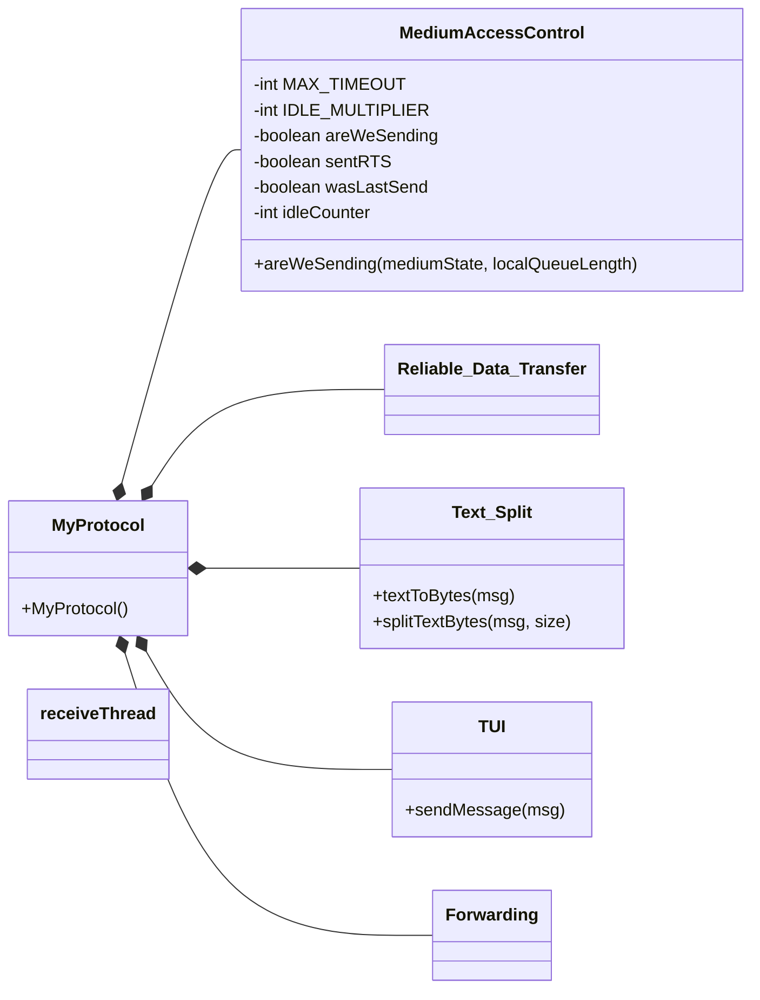

```mermaid
classDiagram
    direction LR
    
    class MyProtocol {
        +MyProtocol()
    }
    
    class MediumAccessControl{
        -int MAX_TIMEOUT
        -int IDLE_MULTIPLIER    
        -boolean areWeSending
        -boolean sentRTS
        -boolean wasLastSend
        -int idleCounter
        
        +areWeSending(mediumState, localQueueLength)
    }
    
    class Reliable_Data_Transfer{
    
    }
    
    class Text_Split{
        +textToBytes(msg)
        +splitTextBytes(msg, size)
    }
    
    class TUI {
        +sendMessage(msg)
    }
    
    class Forwarding{
    
    }
    
    class receiveThread{
    
    }
    
    MyProtocol *-- MediumAccessControl
    MyProtocol *-- Reliable_Data_Transfer
    MyProtocol *-- Text_Split
    MyProtocol *-- TUI
    MyProtocol *-- Forwarding
```