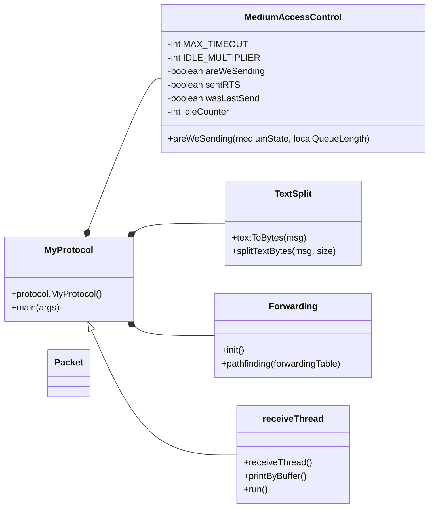

```mermaid
classDiagram
    direction LR
    
    class MyProtocol {
        +protocol.MyProtocol()
        +main(args)
    }
    
    class Packet {
    }
    
    class MediumAccessControl{
        -int MAX_TIMEOUT
        -int IDLE_MULTIPLIER    
        -boolean areWeSending
        -boolean sentRTS
        -boolean wasLastSend
        -int idleCounter
        
        +areWeSending(mediumState, localQueueLength)
    }
    
    class TextSplit{
        +textToBytes(msg)
        +splitTextBytes(msg, size)
    }
    
    class Forwarding{
        +init()
        +pathfinding(forwardingTable)
    }
    
    class receiveThread{
        +receiveThread()
        +printByBuffer()
        +run()
    }
    
    MyProtocol *-- MediumAccessControl
    MyProtocol *-- TextSplit
    MyProtocol *-- Forwarding
    MyProtocol <|-- receiveThread
```