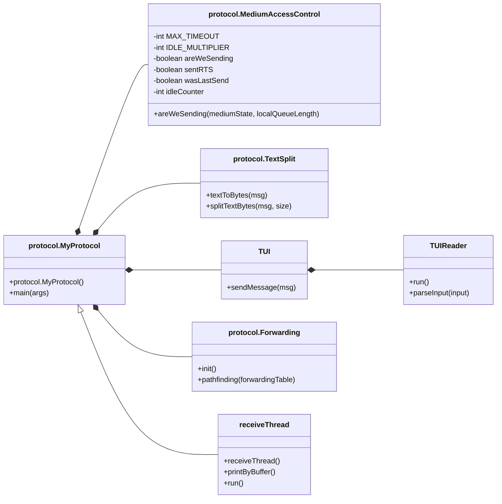

```mermaid
classDiagram
    direction LR
    
    class protocol.MyProtocol {
        +protocol.MyProtocol()
        +main(args)
    }
    
    class protocol.MediumAccessControl{
        -int MAX_TIMEOUT
        -int IDLE_MULTIPLIER    
        -boolean areWeSending
        -boolean sentRTS
        -boolean wasLastSend
        -int idleCounter
        
        +areWeSending(mediumState, localQueueLength)
    }
    
    class protocol.TextSplit{
        +textToBytes(msg)
        +splitTextBytes(msg, size)
    }
    
    class TUI{
        +sendMessage(msg)
    }
    
    class TUIReader{
        +run()
        +parseInput(input)
    }
    
    class protocol.Forwarding{
        +init()
        +pathfinding(forwardingTable)
    }
    
    class receiveThread{
        +receiveThread()
        +printByBuffer()
        +run()
    }
    
    protocol.MyProtocol *-- protocol.MediumAccessControl
    protocol.MyProtocol *-- protocol.TextSplit
    protocol.MyProtocol *-- TUI
    protocol.MyProtocol *-- protocol.Forwarding
    protocol.MyProtocol <|-- receiveThread
    TUI *-- TUIReader
```