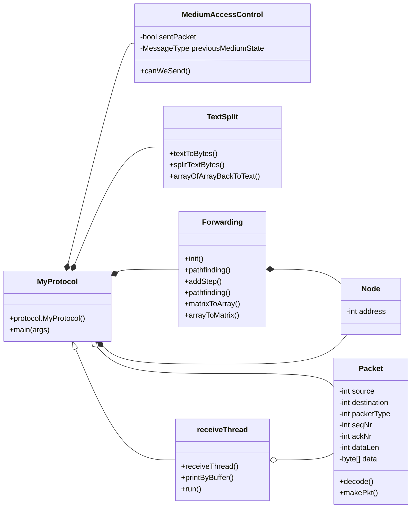

```mermaid
classDiagram
    direction LR
    
    class MyProtocol {
        +protocol.MyProtocol()
        +main(args)
    }
    
    class Packet {
        -int source
        -int destination
        -int packetType
        -int seqNr
        -int ackNr
        -int dataLen
        -byte[] data
        +decode()
        +makePkt()
    }
    
    class MediumAccessControl{
        -bool sentPacket
        -MessageType previousMediumState
        
        +canWeSend()
    }
    
    class TextSplit{
        +textToBytes()
        +splitTextBytes()
        +arrayOfArrayBackToText()
    }
    
    class Forwarding{
        +init()
        +pathfinding()
        +addStep()
        +pathfinding()
        +matrixToArray()
        +arrayToMatrix()
    }
    
    class receiveThread{
        +receiveThread()
        +printByBuffer()
        +run()
    }
    
    class Node{
        -int address
    }
    
    MyProtocol *-- MediumAccessControl
    MyProtocol *-- TextSplit
    MyProtocol *-- Forwarding
    MyProtocol <|-- receiveThread
    Forwarding *-- Node
    MyProtocol *-- Node
    MyProtocol o-- Packet
    receiveThread o-- Packet
```